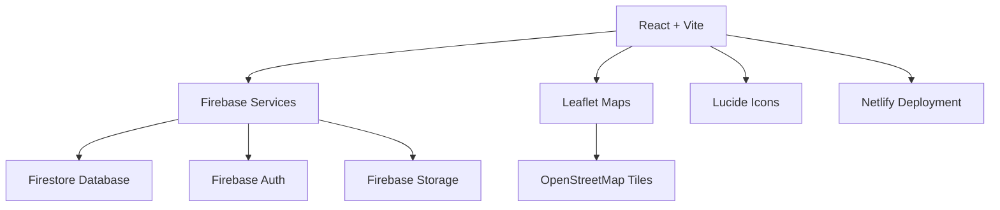

# FuelPulse - Comprehensive Project Walkthrough

## 📋 Project Overview

**FuelPulse** is a real-time, crowd-sourced fuel station tracking platform designed specifically for Lagos, Nigeria. The application addresses critical pain points in the Nigerian fuel retail landscape by providing accurate, community-verified data on fuel availability, prices, and queue lengths.

**Live Application**: [https://petrol-station-tracker.netlify.app/](https://petrol-station-tracker.netlify.app/)

---

## 🎯 Problem Statement

The application was created to solve several critical challenges:

- **Data Opacity**: Official prices often differ from actual pump prices, and availability changes hourly
- **Time Waste**: Drivers queue for hours at stations that run out of fuel mid-way
- **"Ghost" Stations**: Many stations listed on maps are permanently closed or used only for storage
- **GPS Imprecision**: Traditional mapping apps fail at "last-mile" navigation in high-density areas

---

## 🏗️ Architecture Overview

### Technology Stack



**Frontend**:
- React 19.2.0 (Vite build system)
- Vanilla CSS with Glassmorphism design
- Leaflet + React-Leaflet for mapping
- Lucide-React for icons
- Recharts for analytics

**Backend**:
- Firebase Firestore (Real-time database)
- Firebase Authentication (Email/Password)
- Firebase Storage (Photo uploads)

**Deployment**:
- Netlify (Auto-deployment from GitHub)
- Progressive Web App (PWA) capabilities
- Capacitor for Android deployment

---

## 📊 Data Model

### Firestore Collections

#### `stations` Collection

```javascript
{
  id: "string",
  name: "MRS Festac",
  address: "21/22 Rd Junction, Festac Town",
  area: "Festac",
  coords: {
    lat: 6.4698,
    lng: 3.2815
  },
  status: "active" | "inactive",
  queueStatus: "short" | "medium" | "long",
  prices: {
    petrol: 950,
    diesel: 1100,
    gas: 800
  },
  lastUpdated: timestamp,
  lastReporterName: "John Doe",
  lastPhotoUrl: "https://storage.../photo.jpg",
  lastPhotoThumbUrl: "https://storage.../thumb.jpg",
  hasPhoto: true,
  reportQuality: 0.85,
  reports: 42
}
```

#### `stations/{id}/reviews` Subcollection

```javascript
{
  id: "auto-generated",
  userId: "uid123",
  userName: "user@example.com",
  rating: 4,
  text: "Great service, short queue",
  timestamp: timestamp
}
```

#### `stations/{id}/reports` Subcollection

```javascript
{
  timestamp: serverTimestamp(),
  userId: "uid123",
  fuelType: "petrol",
  availability: "available",
  queueLength: 15,
  price: 950,
  reporterName: "John Doe",
  photoUrl: "https://storage.../photo.jpg",
  photoThumbUrl: "https://storage.../thumb.jpg",
  hasPhoto: true,
  quality: 0.85,
  verified: false,
  verificationCount: 0
}
```

#### `users` Collection

```javascript
{
  id: "uid (matches Auth)",
  email: "user@example.com",
  role: "admin" | "user",
  createdAt: timestamp,
  displayName: "John Doe",
  stats: {
    reportsSubmitted: 12,
    reviewsWritten: 5
  }
}
```

#### `priceAlerts` Collection

```javascript
{
  id: "auto-generated",
  userId: "uid123",
  stationId: "station123",
  fuelType: "petrol",
  targetPrice: 900,
  createdAt: timestamp,
  active: true
}
```

---

## 🎨 Core Features

### 1. **Interactive Map View**

- Real-time station markers with color-coded status
- Custom markers showing queue status (✅ Short, ⏳ Medium, 🚨 Long)
- Click-to-pin location for manual GPS override
- Map legend for easy understanding
- Smooth animations and transitions

**Implementation**: [`MapContainer.jsx`](file:///C:/Users/USER/.gemini/antigravity/scratch/petrol-station-tracker/src/components/MapContainer.jsx)

### 2. **Station List & Filtering**

**Filter Options**:
- Status (Active/Inactive/All)
- Fuel Type (Petrol/Diesel/Gas)
- Queue Length (Short/Medium/Long)
- Search by name or address
- Distance sorting (when location available)

**Visual Indicators**:
- 📸 Verified badge for photo-backed reports
- 🟢🟡🔴 Freshness indicators
- Distance display (meters for <1km, km for >1km)

**Implementation**: [`StationList.jsx`](file:///C:/Users/USER/.gemini/antigravity/scratch/petrol-station-tracker/src/components/StationList.jsx)

### 3. **Find Nearest Station**

**Features**:
- High-accuracy GPS positioning
- Filters for active stations only
- Top 3 diagnostic results display
- GPS accuracy indicator (±meters)
- Manual location pinning for weak GPS areas
- Travel time estimation

**Implementation**: [`App.jsx`](file:///C:/Users/USER/.gemini/antigravity/scratch/petrol-station-tracker/src/App.jsx) (lines 289-420)

### 4. **Station Reporting System**

**Report Capabilities**:
- Fuel availability status
- Queue length (in minutes)
- Current prices (₦)
- Photo evidence upload
- Reporter name attribution

**Verification & Quality**:
- Duplicate detection (5-minute window)
- Rate limiting (5 reports/hour)
- Data validation
- Quality scoring (0-1 scale)
- Confirmation dialog before submission

**Implementation**: 
- [`ReportModal.jsx`](file:///C:/Users/USER/.gemini/antigravity/scratch/petrol-station-tracker/src/components/ReportModal.jsx)
- [`verificationService.js`](file:///C:/Users/USER/.gemini/antigravity/scratch/petrol-station-tracker/src/services/verificationService.js)

### 5. **Photo Upload System**

**Features**:
- Camera or file selection
- Automatic compression (max 1MB)
- Thumbnail generation (200px)
- Real-time preview
- Secure validation (10MB max, JPG/PNG/WebP)
- Firebase Storage integration

**Quality Scoring**:
- Has photo: +30%
- Has price: +20%
- Has queue info: +20%
- Is logged in: +20%
- Has name: +10%

**Implementation**: [`photoService.js`](file:///C:/Users/USER/.gemini/antigravity/scratch/petrol-station-tracker/src/services/photoService.js)

### 6. **User Reviews & Ratings**

- 1-5 star rating system
- Text reviews
- Timestamp tracking
- User attribution
- Delete own reviews

**Implementation**: 
- [`ReviewList.jsx`](file:///C:/Users/USER/.gemini/antigravity/scratch/petrol-station-tracker/src/components/ReviewList.jsx)
- [`AddReviewModal.jsx`](file:///C:/Users/USER/.gemini/antigravity/scratch/petrol-station-tracker/src/components/AddReviewModal.jsx)

### 7. **Price Alerts**

**Features**:
- Set target price for specific fuel types
- Automatic notifications when price drops
- Manage multiple alerts
- Station-specific or area-wide alerts
- Active/inactive toggle

**Implementation**: 
- [`PriceAlertModal.jsx`](file:///C:/Users/USER/.gemini/antigravity/scratch/petrol-station-tracker/src/components/PriceAlertModal.jsx)
- [`AlertsList.jsx`](file:///C:/Users/USER/.gemini/antigravity/scratch/petrol-station-tracker/src/components/AlertsList.jsx)
- [`alertService.js`](file:///C:/Users/USER/.gemini/antigravity/scratch/petrol-station-tracker/src/services/alertService.js)

### 8. **Fleet Dashboard**

**Purpose**: Enterprise-grade tool for fleet managers and logistics companies

**Features**:
- Depot-centric distance calculations
- High-density table view
- Fleet analytics (pie charts, bar charts)
- CSV export for accounting
- Network-wide availability overview
- Price trend analysis

**Depot Locations**:
- Apapa (Port Area)
- Ikeja (Commercial Hub)
- Lekki (Residential/Commercial)

**Implementation**: [`FleetDashboard.jsx`](file:///C:/Users/USER/.gemini/antigravity/scratch/petrol-station-tracker/src/components/FleetDashboard.jsx)

### 9. **Admin Dashboard**

**Admin-Only Features**:
- Import stations from OpenStreetMap
- Add new stations manually
- Fix station addresses
- Repair coordinate clusters
- Grant admin roles to users
- Restore manual station data

**Security**: Role-Based Access Control (RBAC) via Firestore rules

**Implementation**: [`AdminDashboard.jsx`](file:///C:/Users/USER/.gemini/antigravity/scratch/petrol-station-tracker/src/components/AdminDashboard.jsx)

### 10. **User Authentication**

**Methods**:
- Email/Password sign up
- Email/Password login
- Logout
- Session persistence

**Protected Features**:
- Photo uploads (login required)
- Station reporting (optional but encouraged)
- Reviews and ratings
- Admin functions

**Implementation**: [`AuthModal.jsx`](file:///C:/Users/USER/.gemini/antigravity/scratch/petrol-station-tracker/src/components/AuthModal.jsx)

### 11. **User Profile**

**Features**:
- Display name and email
- Contribution statistics
- Report history
- Review history
- Account management

**Implementation**: [`UserProfileModal.jsx`](file:///C:/Users/USER/.gemini/antigravity/scratch/petrol-station-tracker/src/components/UserProfileModal.jsx)

### 12. **Mobile Responsiveness**

**Mobile-Specific Features**:
- Bottom navigation bar
- Swipeable bottom sheet for station details
- Map/List view toggle
- Touch-optimized controls
- Compact filter bar
- Responsive layouts

**Implementation**: 
- [`MobileBottomNav.jsx`](file:///C:/Users/USER/.gemini/antigravity/scratch/petrol-station-tracker/src/components/MobileBottomNav.jsx)
- [`StationBottomSheet.jsx`](file:///C:/Users/USER/.gemini/antigravity/scratch/petrol-station-tracker/src/components/StationBottomSheet.jsx)

---

## 🔧 Service Layer

### [`stationService.js`](file:///C:/Users/USER/.gemini/antigravity/scratch/petrol-station-tracker/src/services/stationService.js)

**Functions**:
- `subscribeToStations()` - Real-time Firestore listener
- `updateStationStatus()` - Submit station reports
- `addStation()` - Create new station
- `calculateDistance()` - Haversine formula for GPS distance
- `formatDistance()` - Human-readable distance (meters/km)
- `calculateTravelTime()` - Estimate travel duration
- `seedInitialData()` - Restore manual station data

### [`authService.js`](file:///C:/Users/USER/.gemini/antigravity/scratch/petrol-station-tracker/src/services/authService.js)

**Functions**:
- `subscribeToAuth()` - Listen for auth state changes
- `signUp()` - Create new user account
- `login()` - Authenticate user
- `logout()` - Sign out user

### [`photoService.js`](file:///C:/Users/USER/.gemini/antigravity/scratch/petrol-station-tracker/src/services/photoService.js)

**Functions**:
- `compressImage()` - Reduce file size to max 1MB
- `createThumbnail()` - Generate 200px thumbnail
- `uploadPhoto()` - Upload to Firebase Storage
- `deletePhoto()` - Remove photo from storage
- `validateImageFile()` - Check file type and size

### [`verificationService.js`](file:///C:/Users/USER/.gemini/antigravity/scratch/petrol-station-tracker/src/services/verificationService.js)

**Functions**:
- `checkDuplicateReport()` - 5-minute cooldown check
- `checkRateLimit()` - 5 reports/hour enforcement
- `validateReportData()` - Data integrity validation
- `calculateReportQuality()` - Quality score (0-1)
- `getUserReportCount()` - Track user activity

### [`osmService.js`](file:///C:/Users/USER/.gemini/antigravity/scratch/petrol-station-tracker/src/services/osmService.js)

**Functions**:
- `importLagosStationsV3()` - Import from OpenStreetMap
- `enrichStationData()` - Reverse geocoding for addresses
- `fetchOSMStations()` - Query Overpass API
- `reverseGeocode()` - Get address from coordinates

### [`priceService.js`](file:///C:/Users/USER/.gemini/antigravity/scratch/petrol-station-tracker/src/services/priceService.js)

**Functions**:
- `getPriceHistory()` - Fetch historical price data
- `getAveragePrice()` - Calculate area averages
- `comparePrices()` - Price comparison analysis

### [`alertService.js`](file:///C:/Users/USER/.gemini/antigravity/scratch/petrol-station-tracker/src/services/alertService.js)

**Functions**:
- `createPriceAlert()` - Set new alert
- `getUserAlerts()` - Fetch user's alerts
- `deleteAlert()` - Remove alert
- `checkAlerts()` - Monitor price changes
- `toggleAlertStatus()` - Enable/disable alerts

### [`userService.js`](file:///C:/Users/USER/.gemini/antigravity/scratch/petrol-station-tracker/src/services/userService.js)

**Functions**:
- `grantAdminRole()` - Promote user to admin
- `getUserProfile()` - Fetch user data
- `updateUserProfile()` - Update user information

### [`reviewService.js`](file:///C:/Users/USER/.gemini/antigravity/scratch/petrol-station-tracker/src/services/reviewService.js)

**Functions**:
- `addReview()` - Submit station review
- `getReviews()` - Fetch station reviews
- `deleteReview()` - Remove review

---

## 🔒 Security & Access Control

### Firestore Security Rules

**Guest Users** (Unauthenticated):
- ✅ Read stations
- ✅ Read reviews
- ❌ Write anything

**Authenticated Users**:
- ✅ Report station status
- ✅ Add reviews
- ✅ Delete own reviews
- ✅ Upload photos
- ❌ Admin functions

**Admin Users**:
- ✅ All user permissions
- ✅ Create/delete stations
- ✅ Edit all station fields
- ✅ Delete any review
- ✅ Promote users to admin
- ✅ Import/export data

**Implementation**: [`firestore.rules`](file:///C:/Users/USER/.gemini/antigravity/scratch/petrol-station-tracker/firestore.rules)

---

## 🎨 Design System

### Color Palette

```css
--bg-primary: #0f172a;        /* Dark blue-gray */
--bg-secondary: #1e293b;      /* Lighter dark */
--color-active: #22c55e;      /* Green (active) */
--color-inactive: #ef4444;    /* Red (inactive) */
--color-medium: #f59e0b;      /* Amber (medium queue) */
--glass-bg: rgba(255, 255, 255, 0.05);
--glass-border: rgba(255, 255, 255, 0.1);
```

### Design Principles

- **Glassmorphism**: Frosted glass effects with blur
- **Dark Mode**: Primary design aesthetic
- **Vibrant Accents**: Green for active, red for inactive
- **Smooth Animations**: Transitions and micro-interactions
- **Premium Feel**: Modern, state-of-the-art UI

**Implementation**: [`index.css`](file:///C:/Users/USER/.gemini/antigravity/scratch/petrol-station-tracker/src/index.css)

---

## 📱 Progressive Web App (PWA)

### Features

- **Offline Support**: Service worker caching
- **Install Prompt**: Add to home screen
- **Update Notifications**: Auto-reload on new version
- **App Icons**: Custom launcher icons
- **Splash Screen**: Branded loading screen

**Implementation**: 
- [`vite.config.js`](file:///C:/Users/USER/.gemini/antigravity/scratch/petrol-station-tracker/vite.config.js)
- [`ReloadPrompt.jsx`](file:///C:/Users/USER/.gemini/antigravity/scratch/petrol-station-tracker/src/components/ReloadPrompt.jsx)

---

## 🚀 Deployment

### Netlify Configuration

**Build Settings**:
- Build command: `npm run build`
- Publish directory: `dist`
- Auto-deploy: Enabled on GitHub push

**File**: [`netlify.toml`](file:///C:/Users/USER/.gemini/antigravity/scratch/petrol-station-tracker/netlify.toml)

### Android Deployment

**Capacitor Setup**:
- Platform: Android 8.0.1
- Build tool: Android Studio
- Output: APK/AAB for Play Store

**Guide**: [`ANDROID_GUIDE.md`](file:///C:/Users/USER/.gemini/antigravity/scratch/petrol-station-tracker/ANDROID_GUIDE.md)

---

## 🐛 Major Bug Fixes

### 1. **MRS Festac Coordinate Fix**

**Problem**: MRS Festac and AP (Ardova) coordinates were swapped, causing "Find Nearest" to select wrong station.

**Solution**: 
- Created repair script [`fix-mrs-coords.js`](file:///C:/Users/USER/.gemini/antigravity/scratch/petrol-station-tracker/fix-mrs-coords.js)
- Added admin dashboard button for one-click fix
- Updated coordinates: MRS Festac (6.4698, 3.2815), AP (6.4650, 3.2840)

### 2. **Mobile Black Screen Issue**

**Problem**: Station details modal crashed on mobile devices.

**Solution**: 
- Replaced modal with bottom sheet component
- Added error boundary for crash protection
- Improved mobile-specific rendering

**Implementation**: [`ErrorBoundary.jsx`](file:///C:/Users/USER/.gemini/antigravity/scratch/petrol-station-tracker/src/components/ErrorBoundary.jsx)

### 3. **Footer Button Overlap**

**Problem**: Footer navigation blocked left-side buttons.

**Solution**: 
- Adjusted z-index layering
- Repositioned floating action buttons
- Added bottom padding for mobile views

### 4. **StationList Runtime Error**

**Problem**: `onFilterChange is not a function` error.

**Solution**: 
- Fixed prop passing in `App.jsx`
- Added prop validation
- Ensured consistent filter state management

---

## 📈 Key Metrics & Statistics

### Project Size

- **Components**: 21 React components
- **Services**: 10 service modules
- **Total Lines**: ~25,000+ lines of code
- **Dependencies**: 22 npm packages

### Feature Count

- ✅ Real-time station tracking
- ✅ Photo upload & verification
- ✅ User reviews & ratings
- ✅ Price alerts
- ✅ Fleet dashboard
- ✅ Admin dashboard
- ✅ Mobile responsiveness
- ✅ PWA capabilities
- ✅ Role-based access control
- ✅ GPS navigation
- ✅ OpenStreetMap integration

---

## 🔮 Future Roadmap

### Trust & Verification
- Trust scores for verified reporters
- Photo evidence requirements
- Freshness decay for old reports
- Community verification voting

### Advanced Logistics
- Traffic integration for total time calculation
- Savings calculator (drive time vs. price)
- National price index across states

### Enterprise Tools
- Fleet dispatch to driver devices
- Fuel expense logging
- Digital voucher integration

### Connectivity
- Offline map tiles for common areas
- SMS bridge for offline updates
- Full PWA offline support

---

## 📚 Documentation

- **README**: [`README.md`](file:///C:/Users/USER/.gemini/antigravity/scratch/petrol-station-tracker/README.md)
- **Architecture**: [`ARCHITECTURE.md`](file:///C:/Users/USER/.gemini/antigravity/scratch/petrol-station-tracker/ARCHITECTURE.md)
- **Project Overview**: [`PROJECT_OVERVIEW.md`](file:///C:/Users/USER/.gemini/antigravity/scratch/petrol-station-tracker/PROJECT_OVERVIEW.md)
- **Changelog**: [`CHANGELOG.md`](file:///C:/Users/USER/.gemini/antigravity/scratch/petrol-station-tracker/CHANGELOG.md)
- **Android Guide**: [`ANDROID_GUIDE.md`](file:///C:/Users/USER/.gemini/antigravity/scratch/petrol-station-tracker/ANDROID_GUIDE.md)

---

## 🎓 Development Journey

### Version History

**v0.1.0** - Initial release with basic map and station list  
**v0.2.0** - Project structure and Git integration  
**v0.3.0** - Firebase migration and real-time updates  
**v0.4.0** - User authentication  
**v0.5.0** - Reviews and ratings  
**v0.6.0** - Admin roles and smart navigation  
**v0.7.0** - Fleet dashboard and mobile polish  
**Current** - Photo uploads, verification system, price alerts

### Key Milestones

1. ✅ Initial concept and design
2. ✅ Firebase backend integration
3. ✅ User authentication system
4. ✅ Admin role implementation
5. ✅ Fleet dashboard for enterprises
6. ✅ Photo upload and verification
7. ✅ Price alert system
8. ✅ Mobile optimization
9. ✅ PWA deployment
10. 🔄 Android app (in progress)

---

## 🏆 Impact & Benefits

### For Individual Drivers
- ⏱️ Save hours by avoiding empty stations
- 💰 Find cheapest fuel prices nearby
- 📍 Accurate navigation to stations
- 🔔 Get notified of price drops

### For Fleet Managers
- 📊 Optimize fuel costs across fleet
- 🗺️ Depot-centric logistics planning
- 📈 Analytics and reporting
- 💾 CSV export for accounting

### For Community
- 🤝 Crowd-sourced real-time data
- 📸 Photo verification builds trust
- ✅ Quality scoring highlights reliable reports
- 🌐 Transparent, open platform

---

## 🛠️ Local Development

### Setup

```bash
# Clone repository
git clone https://github.com/your-username/petrol-station-tracker.git
cd petrol-station-tracker

# Install dependencies
npm install

# Run development server
npm run dev
```

### Build

```bash
# Production build
npm run build

# Preview build
npm run preview
```

### Firebase Configuration

Create `src/services/firebase.js` with your Firebase credentials:

```javascript
import { initializeApp } from 'firebase/app';
import { getFirestore } from 'firebase/firestore';
import { getAuth } from 'firebase/auth';
import { getStorage } from 'firebase/storage';

const firebaseConfig = {
  apiKey: "YOUR_API_KEY",
  authDomain: "YOUR_AUTH_DOMAIN",
  projectId: "YOUR_PROJECT_ID",
  storageBucket: "YOUR_STORAGE_BUCKET",
  messagingSenderId: "YOUR_MESSAGING_SENDER_ID",
  appId: "YOUR_APP_ID"
};

const app = initializeApp(firebaseConfig);
export const db = getFirestore(app);
export const auth = getAuth(app);
export const storage = getStorage(app);
```

---

## 📞 Support & Contact

For issues, feature requests, or contributions, please refer to the project repository or contact the development team.

---

**Last Updated**: February 3, 2026  
**Version**: 0.7.0+  
**Status**: Active Development
