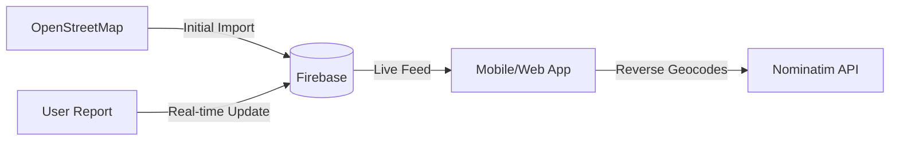

# 📊 Data Sources & APIs

Petrol Pulse relies on a hybrid data model that combines static geographical data with real-time community crowdsourcing.

## 1. Geographical Data (Where are the stations?)
The "skeleton" of our map is built using data from **OpenStreetMap (OSM)**.

### **Overpass API**
We used the Overpass API to "harvest" the initial list of petrol stations. It allowed us to query for specific tags like `amenity=fuel` within the geographical bounds of Lagos, Nigeria.
- **Why?** This ensures we have a verified list of physical station locations without having to manually enter hundreds of coordinates.

### **Nominatim API (Geocoding)**
We use this for **Reverse Geocoding**. Many OSM entries have precise GPS coordinates but "thin" address data (e.g., just "Lagos"). 
- **Function**: The app sends the latitude and longitude to Nominatim, which returns the exact street name, neighborhood, and suburb to make the app's station list more readable.

---

## 2. Live Data (What is happening now?)
Because there is no official, public "Fuel Availability API" in Nigeria, we built our own using a community-driven model.

### **Firebase Firestore**
This is our real-time database. Every time a user submits a report, the data is pushed to Cloud Firestore.
- **Real-time Sync**: The app "subscribes" to Firestore. When a price or queue status changes in the database, it reflects on every user's map instantly without a page refresh.

### **Community Crowdsourcing**
The "Pulse" of the app. Every data point regarding:
- **Price per liter** (PMS, AGO, Gas)
- **Queue Length** (⚡ Quick, ⏳ Mild, 🚨 Long)
- **Availability** (Available, Low, Empty)
...is provided by active users reporting what they see at the pump.

---

## 3. Data Flow Diagram

